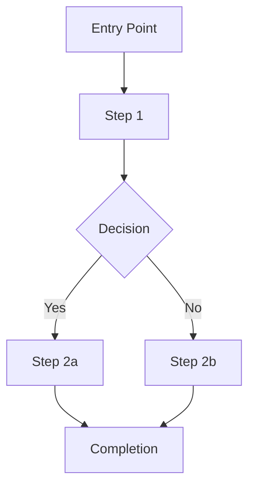
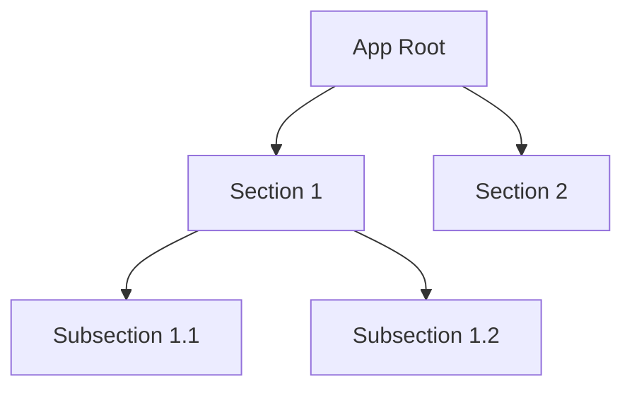

# Design Specification: [Product Name]

## Document Info

| Field | Value |
|-------|-------|
| Version | 1.0 |
| Last Updated | [Date] |
| Status | Draft |
| Author | [Name] |
| Product Spec | [Link to product_spec.md] |

---

## 1. User Personas

### Primary Persona: [Name]
- **Role:** [Description]
- **Goals:** [What they want to achieve]
- **Pain Points:** [Current frustrations]
- **Device/Context:** [Desktop, mobile, tablet; office, field, commute]
- **Accessibility Needs:** [Vision, motor, cognitive considerations]
- **Technical Proficiency:** [Novice, intermediate, expert]

### Secondary Personas
[Repeat structure for each additional persona]

---

## 2. User Flows

### 2.1 [Journey Name]

**Trigger:** [What initiates this flow]
**Goal:** [What the user achieves at the end]

**Notes:** [Edge cases, error paths, alternative flows]

### 2.2 [Journey Name]
[Repeat for each major user journey]

---

## 3. Screen Inventory

| Screen/View | Purpose | Key Elements | Entry Points | Exit Points |
|-------------|---------|--------------|--------------|-------------|
| [Screen 1]  | [Why it exists] | [Buttons, forms, lists] | [How users arrive] | [Where users go next] |

---

## 4. Interaction Patterns

### 4.1 [Screen/Flow Name]
- **Primary Actions:** [Main things users do here]
- **Form Behavior:** [Validation, auto-save, submit flow]
- **Transitions/Animations:** [Page transitions, micro-interactions]
- **Feedback Mechanisms:** [Success messages, progress indicators, toasts]
- **Gesture Support:** [Swipe, long-press, drag if applicable]

---

## 5. Component Specifications

### 5.1 [Component Name]
- **Purpose:** [What it does]
- **States:**
  - Default: [Description]
  - Hover: [Description]
  - Active/Pressed: [Description]
  - Disabled: [Description]
  - Loading: [Description]
  - Error: [Description]
- **Variants:** [Size, color, style variations]
- **Props/Inputs:** [Configurable attributes]
- **Accessibility:**
  - Role: [ARIA role]
  - Aria-labels: [Label text]
  - Keyboard behavior: [Tab, Enter, Escape, Arrow keys]
  - Screen reader announcement: [What is read aloud]

---

## 6. Information Architecture

### 6.1 Navigation Structure

### 6.2 Content Hierarchy
- **Primary content:** [What dominates the page]
- **Secondary content:** [Supporting information]
- **Tertiary content:** [Metadata, actions, navigation]

---

## 7. Responsive Behavior

| Breakpoint | Width | Layout Changes | Navigation Changes |
|------------|-------|----------------|--------------------|
| Mobile | <768px | [Single column, stacked cards] | [Bottom nav or hamburger] |
| Tablet | 768-1024px | [Two column, side panel] | [Sidebar or top nav] |
| Desktop | >1024px | [Multi-column, full layout] | [Persistent sidebar] |

---

## 8. Accessibility Requirements

- **WCAG Target:** 2.1 AA
- **Keyboard Navigation:**
  - All interactive elements reachable via Tab
  - Logical tab order follows visual layout
  - Escape closes modals/dropdowns
  - Arrow keys for list/menu navigation
- **Screen Reader Notes:**
  - All images have alt text
  - Form fields have associated labels
  - Status changes announced via aria-live regions
  - Headings follow proper hierarchy (h1 > h2 > h3)
- **Color Contrast:** Minimum 4.5:1 for normal text, 3:1 for large text
- **Focus Management:**
  - Visible focus indicators on all interactive elements
  - Focus trapped in modals when open
  - Focus restored to trigger element when modal closes
- **Motion/Animation:** Respect `prefers-reduced-motion` media query

---

## 9. Visual Design References

### Figma Links
- [PLACEHOLDER — add Figma project URL]
- [PLACEHOLDER — add specific frame links]

### Screenshots / Mockups
- [PLACEHOLDER — add screenshot paths or URLs]

### Design Tokens
- [PLACEHOLDER — link to design token system or file]

### Color Palette
| Token | Value | Usage |
|-------|-------|-------|
| --primary | [Color] | [Primary actions, links] |
| --secondary | [Color] | [Secondary actions] |
| --destructive | [Color] | [Delete, error states] |
| --muted | [Color] | [Disabled, placeholder] |

### Typography Scale
| Level | Font | Size | Weight | Line Height |
|-------|------|------|--------|-------------|
| h1 | [Font] | [Size] | [Weight] | [Height] |
| body | [Font] | [Size] | [Weight] | [Height] |

### Spacing System
- Base unit: [4px / 8px]
- Scale: [xs, sm, md, lg, xl, 2xl]

### Iconography
- Icon set: [Lucide, Heroicons, custom]
- Default size: [16px, 20px, 24px]

---

## 10. Error States & Edge Cases

### 10.1 Empty States
| Screen | Empty State Message | Action |
|--------|-------------------|--------|
| [Screen] | [Message when no data] | [CTA to add data] |

### 10.2 Loading States
| Screen/Component | Loading Pattern | Duration Threshold |
|-----------------|-----------------|-------------------|
| [Screen] | [Skeleton, spinner, shimmer] | [Show after Xms] |

### 10.3 Error States
| Error Type | Message | Recovery Action |
|-----------|---------|-----------------|
| Network error | [Message] | [Retry button] |
| Validation error | [Message] | [Inline field error] |
| Server error | [Message] | [Contact support] |

### 10.4 Offline Behavior
- [Describe offline support or lack thereof]

### 10.5 Boundary Conditions
- Max items in lists: [Limit]
- Max text length in inputs: [Limit]
- Concurrent user handling: [Strategy]

---

## 11. Design Decisions

| Decision | Choice | Alternatives Considered | Rationale |
|----------|--------|------------------------|-----------|
| [Decision 1] | [What was chosen] | [Other options] | [Why this choice] |

---

## Appendix

### Glossary
| Term | Definition |
|------|-----------|

### References
- [Product Spec](./product_spec.md)
- [Brainstorm](./brainstorm.md)

### Open Questions
- [Question 1]
